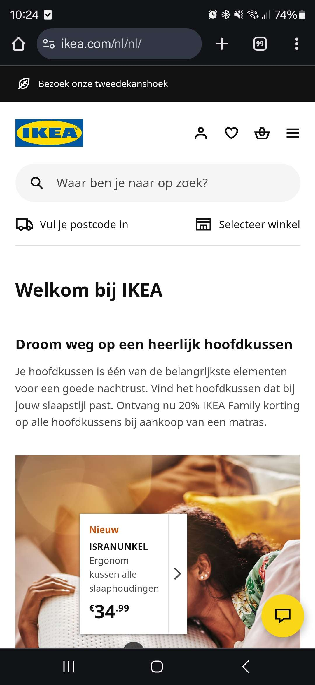
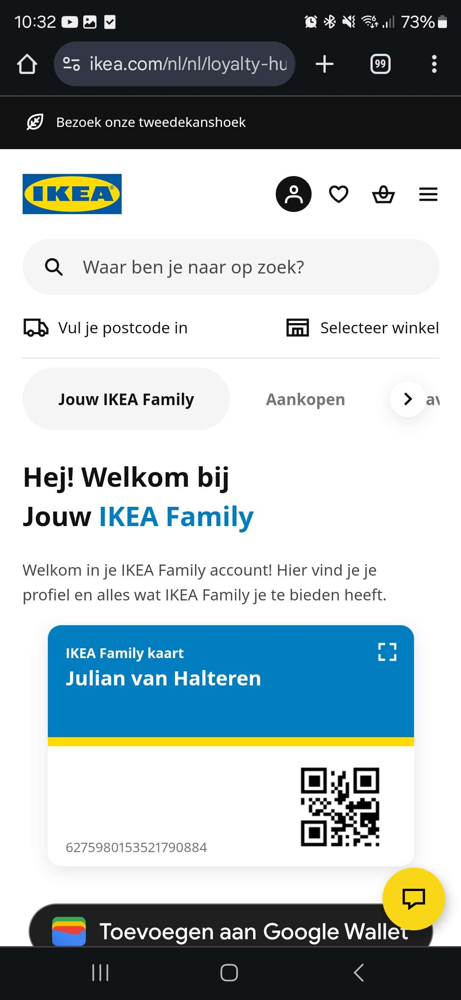
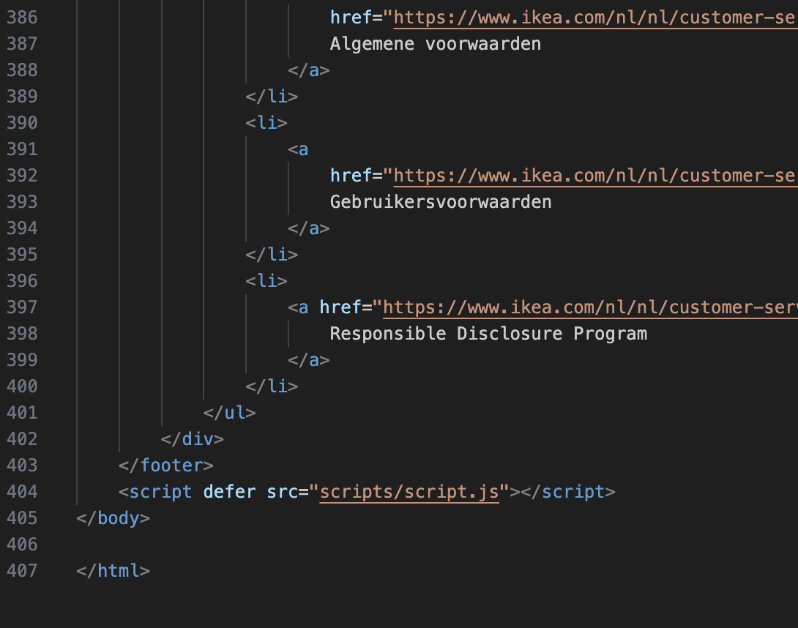

# Procesverslag
Markdown is een simpele manier om HTML te schrijven.  
Markdown cheat cheet: [Hulp bij het schrijven van Markdown](https://github.com/adam-p/markdown-here/wiki/Markdown-Cheatsheet).

Nb. De standaardstructuur en de spartaanse opmaak van de README.md zijn helemaal prima. Het gaat om de inhoud van je procesverslag. Besteedt de tijd voor pracht en praal aan je website.

Nb. Door *open* toe te voegen aan een *details* element kun je deze standaard open zetten. Fijn om dat steeds voor de relevante stuk(ken) te doen.

## Jij

  
uitwerken voor kick-off werkgroep

  ### Auteur:
  Julian van Halteren

  #### Je startniveau:
  rood

  #### Je focus:
  surface plane
 

## Je website

  
uitwerken voor kick-off werkgroep

  ### Je opdracht:
    https://www.ikea.com/nl/nl/

  #### Screenshot(s) van de eerste pagina (small screen): 
  Ikea homepagine  
  

  #### Screenshot(s) van de tweede pagina (small screen):
  hier de naam van de pagina  
  
 

## Toegankelijkheidstest 1/2 (week 1)

  
uitwerken na test in 2e werkgroep

  ### Bevindingen
  Lijst met je bevindingen die in de test naar voren kwamen:
  De alt-tekst wordt goed voorgelezen
  icoontjes worden niet voorgelezen
  lijntjes leest die ook voor.
  Ikea product nummers worden opgenoemt.
  Ikea geeft de optie voor mensen met screenreaders om lijsten over te slaan, zoals te zien is in deze afbeelding. Deze optie is er ook alleen voor als je een screenreader hebt zodat je niet door de gehele lijst hoeft te scrollen.
  

  Bij bekijk onze services wordt bij elke service opgenoemd dat je in een lijst zit en dat je bij elke onderdeel in een nieuwe lijst terecht komt.

## Breakdownschets (week 1)

  
uitwerken na afloop 3e werkgroep

  ### de hele pagina: 
  

  ### dynamisch deel (bijv menu): 
  

  ### wellicht nog een dynamisch deel (bijv filter): 
  

## Voortgang 1 (week 2)

  
uitwerken voor 1e voortgang

  ### Stand van zaken
  hier dit ging goed & dit was lastig (neem ook screenshots op van delen van je website en code)
  Ik heb in de eerste week grotendeels van de html structuur gemaakt. Wat ik nog aan de HTML moet toevoegen zijn vooral de afbeeldingen en icoontjes.
  Dit kan ik nu vooral doen in week 2. Ook kan ik al de correcte fonts en kleurtjes toevoegen in de :root van de css. Ook moet ik nog de html elementen toevoegen die niet direct zichtbaar zijn. zoals de hamburger menu's en bepaalde elementen die informatie vertonen als je erop klikt zoals bij buttons.
  Wat ging goed?
  Het overtypen van alle elementen en het indelen van de section's div's en articles
  Wat ging fout?
  Het maken van de html voordat ik de breakdownschets heb gemaakt. Waardoor ik veel heen en weer moest gaan in stappen.
   

  ### Agenda voor meeting
  samen met je groepje opstellen

  | student 1      | student 2          | student 3    | student 4        |
  | ---            | ---                | ---          | ---              |
  | dit bespreken  | en dit             | en ik dit    | en dan ik dat    |
  | en dat ook nog | dit als er tijd is | nog een punt | dit wil ik zeker |
  | ...            | ...                | ...          | ...              |

  ### Verslag van meeting
  hier na afloop snel de uitkomsten van de meeting vastleggen

  - punt 1
  - punt 2
  - nog een punt
  - ...

## Voortgang 2 (week 3)

  
uitwerken voor 2e voortgang

  ### Stand van zaken
  hier dit ging goed & dit was lastig (neem ook screenshots op van delen van je website en code)

  ### Agenda voor meeting
  samen met je groepje opstellen

  | student 1      | student 2          | student 3    | student 4        |
  | ---            | ---                | ---          | ---              |
  | dit bespreken  | en dit             | en ik dit    | en dan ik dat    |
  | en dat ook nog | dit als er tijd is | nog een punt | dit wil ik zeker |
  | ...            | ...                | ...          | ...              |

  ### Verslag van meeting
  hier na afloop snel de uitkomsten van de meeting vastleggen

  summary details hamburger menu readme surface plain 5 verschillende dingen
  variable gebruiken voor afstanden, fonts, padding.

  - punt 1
  - punt 2
  - nog een punt
- ...

## Toegankelijkheidstest 2/2 (week 4)

  
uitwerken na test in 9e werkgroep

  ### Bevindingen
  Lijst met je bevindingen die in de test naar voren kwamen (geef ook aan wat er verbeterd is):

  eigenwebsite is minder toegankelijk dan de orginele ikea website. Dit komt door de onzichtbare lijst skip onderdelen van de ikea website.

## Voortgang 3 (week 4)

  
uitwerken voor 3e voortgang

  ### Stand van zaken
  hier dit ging goed & dit was lastig (neem ook screenshots op van delen van je website en code)

  5 surface plane dingen
  * Custom themes - darkmode toevoegen
  * animations - family card animation
  * Video/Geluid ?? ikea jingle mischien toevoegen
  *   Meer complete mirco interacties??
  * 

   dropdown menu/ hamburger menu vallen onder? 
   fixed header is misch iets?
   hart icoontje iets animeren misch als extra?
  Scroll animation toevoegen is wel te doen vgm toch? zo ja hoe

  ### Agenda voor meeting
  samen met je groepje opstellen

  | student 1      | student 2          | student 3    | student 4        |
  | ---            | ---                | ---          | ---              |
  | dit bespreken  | en dit             | en ik dit    | en dan ik dat    |
  | en dat ook nog | dit als er tijd is | nog een punt | dit wil ik zeker |
  | ...            | ...                | ...          | ...              |

  ### Verslag van meeting
  hier na afloop snel de uitkomsten van de meeting vastleggen

    articles aanpassen naar sections. en dan maar classes gebruiken D:
    

  - punt 1
  - punt 2
  - nog een punt
  - ...

## Eindgesprek (week 5)

  
uitwerken voor eindgesprek

  ### Je uitkomst - karakteristiek screenshots:
  

  ### Dit ging goed/Heb ik geleerd: 
  Korte omschrijving met plaatjes

  

  ### Dit was lastig/Is niet gelukt:
  Korte omschrijving met plaatjes

  

## Bronnenlijst

  
continu bijhouden terwijl je werkt

  Nb. Wees specifiek ('css-tricks' als bron is bijv. niet specifiek genoeg). 
  Nb. ChatGpT en andere AI horen er ook bij.
  Nb. Vermeld de bronnen ook in je code.

  1. bron 1
  2. bron 2
  3. ...

